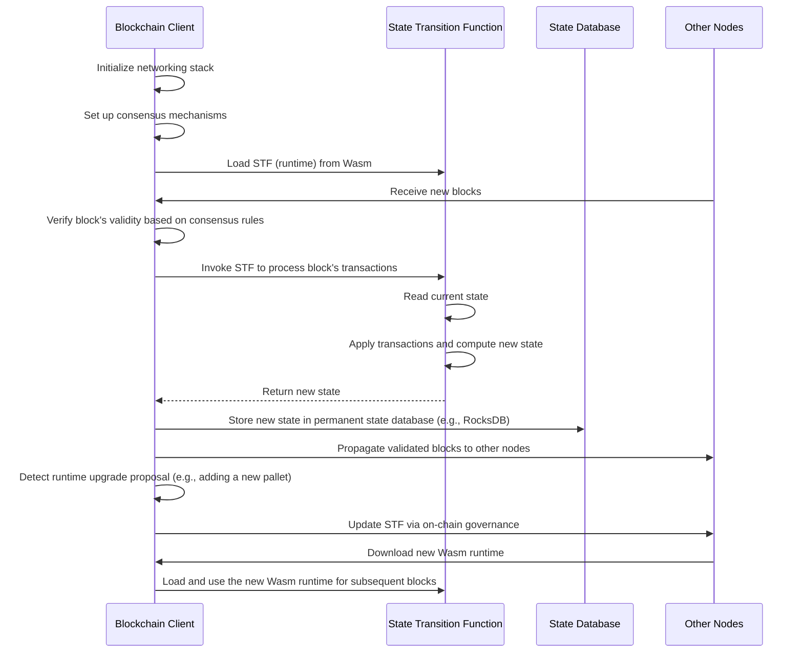

# Dot Code School Solutions

This repository contains my solutions for the [DotCodeSchool Courses](https://dotcodeschool.com/). It also contains some notes I made along the way.

## State Machine Concept:

A state machine is a computational model that can be in exactly one of a finite number of states at any given time
It transitions between these states based on specific rules or inputs
In computing, state machines are used to model systems with well-defined, predictable behavior

## State in Blockchain
### Global State: 
Represents the entire data of the blockchain at a specific point in time. This includes account balances, smart contract data, and more.
### State Transition Function: 
The rules that define how the blockchain moves from one state to another based on transactions.

## State Transitions:
Transactions cause state transitions
Each transaction is like an input that moves the blockchain from one valid state to another.
These transitions follow strict consensus rules.
Every node in the network applies the same state transition logic to maintain consistency

## Pallet:
"Pallet" is a term specific to the Polkadot SDK, which refers to Rust modules which contain logic specific for your blockchain runtime.

## Blockchain Client:
The blockchain client is the software component responsible for managing the network interactions, consensus mechanism, peer-to-peer communication, transaction propagation, block production, and overall coordination of the blockchain nodes.

## State transition function
The state transition function defines how the blockchain's state changes in response to transactions and blocks. It encapsulates the business logic, rules, and operations that govern the blockchain's behavior. (If applicable) Manages the execution and state of smart contracts.

## DotCodeSchool Lecture flow:

### Balances Pallet:

* At the heart of a blockchain is a state machine.
* This Pallet will tell you: how much balance each user has, provide functions which allow users to transfer those balances, and even some low level functions to allow your blockchain system to manipulate those balances if needed.
* We can add state to our pallet by adding fields (like balances{BTreeMap}) into our Pallet struct.
* Add functions to our pallet to allow users to interact with the state.

### System Pallet
* The System Pallet is a "meta"-pallet which stores all the metadata needed for your blockchain to function. For example, the current blocknumber or the nonce of users on your blockchain.
* This pallet does not need to expose any functions to end users, but can still play an important role in our overall state transition function.
* System Pallet needs to expose functions which allow us to access and modify the **block number** and the **nonce**.
* **Block number**: Your blockchain's blocknumber stored in the System Pallet.
* **Nonce**: In this context, each user on your blockchain has a nonce which gives a unique value to each transaction the user submits to the blockchain. We keep track of 'nonce':'count_of_transactions' in a BTreeMap.