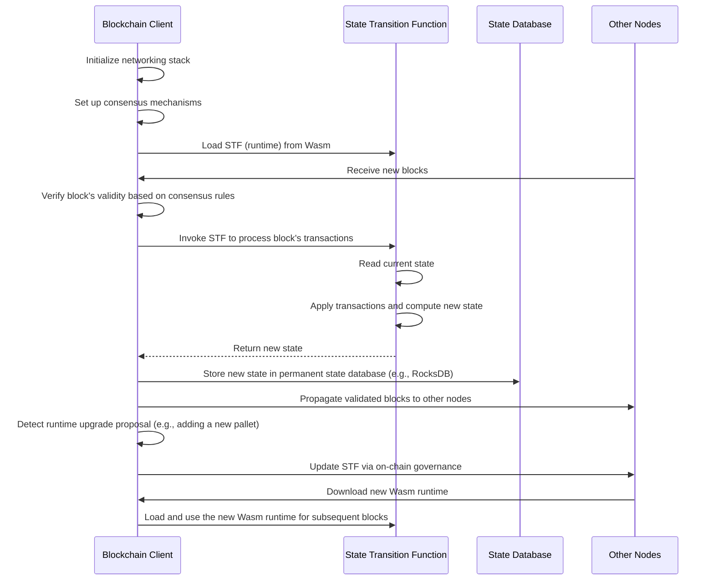

# Dot Code School Solutions

This repository contains my solutions for the [DotCodeSchool Courses](https://dotcodeschool.com/). It also contains some notes I made along the way.

## 1. State Machine Concept:

A state machine is a computational model that can be in exactly one of a finite number of states at any given time
It transitions between these states based on specific rules or inputs
In computing, state machines are used to model systems with well-defined, predictable behavior

## 2. State in Blockchain
### 2.1 Global State: 
Represents the entire data of the blockchain at a specific point in time. This includes account balances, smart contract data, and more.
### 2.2 State Transition Function: 
The rules that define how the blockchain moves from one state to another based on transactions.

## 3. State Transitions:
Transactions cause state transitions
Each transaction is like an input that moves the blockchain from one valid state to another.
These transitions follow strict consensus rules.
Every node in the network applies the same state transition logic to maintain consistency

## 4. Genesis State in Blockchains:

The Genesis State is the initial state of a blockchain. It represents the very first block, often referred to as "block 0" or the "genesis block." This block is unique because it is the only block that does not reference a previous block, as it is the starting point of the blockchain. It contains: Initial Accounts and Balances, Network Parameters, Smart Contracts and Code, and any Configuration Settings.

## 5. Traits
* Traits can contain within it two things:
    * functions which must be implemented by the type
    * associated types
* When you want to use a function or method that is defined within a trait, you need to ensure that the trait is in scope. This is because Rust requires explicit imports for trait methods to avoid ambiguity and to make the code more readable and maintainable.

## 6. Pallet:
"Pallet" is a term specific to the Polkadot SDK, which refers to Rust modules which contain logic specific for your blockchain runtime.

## 7. &'static str:
In Rust, `&'static str` is a type that represents a string slice with a `'static` lifetime. A `'static` lifetime means that the data is either embedded directly in the program's binary (like string literals) or is explicitly allocated to last for the entire program's execution.

## 8. Blockchain Client:
The blockchain client is the software component responsible for managing the network interactions, consensus mechanism, peer-to-peer communication, transaction propagation, block production, and overall coordination of the blockchain nodes.

## 9. State transition function
The state transition function defines how the blockchain's state changes in response to transactions and blocks. It encapsulates the business logic, rules, and operations that govern the blockchain's behavior. (If applicable) Manages the execution and state of smart contracts.


## 10. Enums
* We use enums a lot in polkadot-sdk. Take this for an example:
```rust
pub enum RuntimeCall {
	Balances(balances::Call<Runtime>),
}

pub enum Call<T: Config> {
	Transfer { to: T::AccountID, amount: T::Balance },
}
```
* In this case, we have a variant `RuntimeCall::Balances`, which itself contains a type `balances::Call`. This means we can access all the calls exposed by `balances:Call` under this variant. As we create more pallets or extend our calls (add more variants to the enum `call` in our pallets), this nested structure will scale very well. We call the `RuntimeCall` an **"outer enum"**, and the `balances::Call` an **"inter enum"**.

## 11. DotCodeSchool Lecture flow:

### 11.1 Balances Pallet:

* At the heart of a blockchain is a state machine.
* This Pallet will tell you: how much balance each user has, provide functions which allow users to transfer those balances, and even some low level functions to allow your blockchain system to manipulate those balances if needed.
* We can add state to our pallet by adding fields (like balances{BTreeMap}) into our Pallet struct.
* Add functions to our pallet to allow users to interact with the state.

### 11.2 System Pallet
* The System Pallet is a "meta"-pallet which stores all the metadata needed for your blockchain to function. For example, the current blocknumber or the nonce of users on your blockchain.
* This pallet does not need to expose any functions to end users, but can still play an important role in our overall state transition function.
* System Pallet needs to expose functions which allow us to access and modify the **block number** and the **nonce**.
* **Block number**: Your blockchain's blocknumber stored in the System Pallet.
* **Nonce**: In this context, each user on your blockchain has a nonce which gives a unique value to each transaction the user submits to the blockchain. We keep track of 'nonce':'count_of_transactions' in a BTreeMap.

### 11.3 Runtime Pallet
* You can think of the runtime as the accumulation of all logic which composes your state transition function. It will combine all of your pallets into a single object, and then expose that single object as the entry point for your users to interact with.
* The runtime contains the **System Pallet** and the **Balances Pallet**.

### 11.4 Using Named And Generic Types and making them configurable:
* We use named types to clearly define what a type represents. We make these named types generic so that we can use them with different types.
* We implement a `Config` trait with associated types. Then we can use a single generic parameter `T` in our structs and have a trait bound of `Config` on `T`. This way, we can access data types from `T` like `T::AccountId` and `T::Balance` in our structs.
* We can also use **Trait Inheritance** to keep the repetition to a minimum like - `pub trait Config: crate::system::Config {}`. However, we need to be aware of any **Tight Coupling**. In fact, with Substrate, all pallets are tightly coupled to the System Pallet, because the System Pallet provides all the meta-types for your blockchain system.

### 11.5 Support Pallet
* The `support` module parallels something similar to the `frame_support` crate that you would find in the `Polkadot SDK`. The reason the `frame_support` crate exists, is to allow multiple other crates use common types and trait, while avoiding cyclic dependencies, which is not allowed in Rust.
* The first set of primitives provided by the support module are a set of structs that we need to construct a simple Block in a Blockchain. We keep the Block completely generic over the Header and Extrinsic type.

#### 11.5.1 Block
* A block is basically broken up into two parts: the header and a vector of extrinsics.

##### 11.5.1.1 Header
The block header contains metadata about the block which is used to verify that the block is valid. In our simple state machine, we only store the blocknumber in the header, but real blockchains like Polkadot have:

* Parent Hash
* Block Number
* State Root
* Extrinsics Root
* Consensus Digests / Logs

##### 11.5.1.2 Extrinsics
* In our simple state machine, extrinsics are synonymous with user transactions. Thus our extrinsic type is composed of a Call (the function we will execute) and a Caller (the account that wants to execute that function).Real world blockchains like Polkadot have many different types of extrinsics.

#### 11.5.2 Dispatching Calls
* The runtime, acting as a single entrypoint for the whole state transition function needs to be able to route incoming calls to the appropriate functions in the appropriate pallets. For this, we need the `Dispatch` trait and the `DispatchResult`.
* **Runtime Calls** are an accumulation of all the calls which are exposed to the world. This is useful as a `type` as we can have mappings like `call` and `caller` where the `call` could be of one of the types in `RuntimeCalls`.
* We also define concrete types for the `Block`, `Header`, and `Extrinsic` types.
* We implement the `Dispatch` trait for all pallets. Then we can use a **nested** `dispatch` function to route calls to the appropriate pallet. This way when the pallet code gets updated, we don't have to update anything in the runtime as it would just forward the call to the updated dispatch function in the pallet.

### 11.6 Proof of Existence Pallet
* The Proof of Existence Pallet uses the blockchain to provide a secure and immutable ledger that can be used to verify the existence of a particular document or piece of data at a specific point in time as the blockchain acts as an immutable ledger whose history cannot be changed.
* We use a `BTreeMap` for storage here. In actual blockchains like `PolkaDot`, there usually is a storage layer that is used to store the data. Rather than having a map from accounts to some data, we will actually map the content we want to claim to the user who owns it. This construction of content -> account allows an account to be the owner of multiple different claims, but having each claim only be owned by one user.
* Remember that when we create the `call enum` in each pallet, we don't need to pass the caller data in the enum variants. The `caller` is provided by the `dispatch` logic.

### 11.7 Macros in polkadot-sdk
* All the pallets and the runtime follow a certain pattern and thus we can write and use `macros` for them.

#### 11.7.1 The Call Macro
* The purpose of the `#[macros::call]` macro is to automatically generate the `enum Call` from the functions of the pallet and the pallet level `Dispatch` logic found in each Pallet.
* We can place the `#[macros::call]` attribute over our `impl<T: Config> Pallet<T>` where the callable functions are implemented. From there, the macro can parse the whole object, and extract the data it needs. Not all of your functions are intended to be callable, so you can isolate the functions which should be "callable" in their own `impl<T: Config> Pallet<T>`.
* The Call macro has 2 main files:
  * **Parse**: 
    * In order to generate the code that we want, we need to keep track of each `callable function` (name of that function, each argument name and types) that the developer wants to expose through the Runtime and the name of the `struct` where those functions are implemented. Normally this is `Pallet`, but we can allow the developer flexibility in their naming.
    * These things are tracked with `CallDef` and `CallVariantDef`
    * Also, during the parsing process, we might want to check for certain consistencies in the code being parsed. In this case, we require that every callable function muse have `caller` as their first parameter with `type T::AccountId`. This checking logic is handled by `fn check_caller_arg`.
  * **Expand**:
    * Once we have parsed all the data we need, generating the code is straight forward. If you jump down to `let dispatch_impl = quote!` you will see a bunch of code that looks like the templates we used earlier in the tutorial. We just left markers where the macro generation logic should place all the information to write the code we need.
* Rust provides the command `cargo expand` which allows you to output the generated rust code after all macros have been applied to your project.

#### 11.7.2 The Runtime Macro
* The purpose of the `#[macros::runtime]` macro is to get rid of all of the boilerplate function we implemented for the `Runtime`, including `fn new()` and `fn execute_block()`. Similar to the `Call` macro, it also generates the `enum RuntimeCall` and all the `Dispatch` logic for re-dispatching to pallets.
* **NOTE**: It appears that the `Runtime` macro and the `Call` macro both get rid of the `enum call` and the `Dispatch` logic.
* **NOTE**: Due to the quirks of using macros, our `RuntimeCall` or `Call` enum (from the `Balances` Pallet) will have snake_case variants which exactly match the name of the fields in the Runtime struct.
* We apply the `#[macros::runtime]` attribute on top of the main `struct Runtime` object.
* The Call macro has 2 main files:
  * **Parse**: 
    * In order to generate the code we want, we need to keep track of: The name of the struct representing our Runtime. Usually this is `Runtime`, but we provide flexibility to the developer, The list of Pallets included in our `Runtime`, Their name, as specified by the user and The specific type for their `Pallet`, for example `balances::Pallet` vs `proof_of_existence::Pallet`.
    * All of this information is tracked in the `RuntimeDef` struct. We are also checking that our `Runtime` definition always contains the `System Pallet`, and does so as the first pallet in our `Runtime` definition.
  * **Expand**:
    * Starting with `let runtime_impl = quote!`, you will see the entire `impl Runtime` code block has been swallowed into the macro. Since we know all the pallets in your `Runtime`, we can automatically implement functions like `new()`. The `execute_block` function does not take advantage of any of the parsed data, but the code is completely boilerplate, so we hide it away.
    * We have another code block being generated with `let dispatch_impl = quote!` which is the `enum RuntimeCall` and the implementation of `Dispatch` for `Runtime`.
